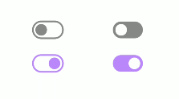

# Compose-Easier


|         CheckBox              |           Switch           |           Button           |           TextField           |                   
| :---------------------------: | :------------------------: | :------------------------: | :---------------------------: |
|  | | | |


<h6 align="start">

  &nbsp;&nbsp;
  &nbsp;&nbsp;
  &nbsp;&nbsp;
</h6>

## Getting started 🍕🍔🍟

1. Ensure your app’s minimum SDK version is 21+. This is declared in the module-level `build.gradle` file.

```gradle
android {
    defaultConfig {
        ...
        minSdk 21
    }
```
2. Ensure the `mavenCentral()` repository is declared in the project-level `build.gradle` or `setting.gradle` file:

    <details><summary>build.gradle (project-level)</summary>

    ```gradle
        allprojects {
            repositories {
                mavenCentral()
                ...
            }
            ...
        }
    ```

    </details>


    <details><summary>settings.gradle</summary>

    ```gradle
    pluginManagement {
        repositories {
            ...
            mavenCentral()
        }
    }
    dependencyResolutionManagement {
        ...
        repositories {
            ...
            mavenCentral()
        }
    }
    ```

    </details>


3. Declare the dependencies in the module-level `build.gradle` file
```gradle
    dependencies {
        implementation("io.github.torrydo:compose-easier:<LATEST_VERSION>")
    }
```

## Usage 🚗🏍🚄

> the parameters are quite similar to the default composable. you can use it without hassle ✨🎉

1. CheckBox ✅

```kotlin
var state by remember { mutableStateOf(false) }

CheckBoxEz.RoundedCorner(checked = state, onChange = { state = it })

```

2. Switch 🥪

```kotlin
var state by remember { mutableStateOf(false) }

SwitchEz.Border(isOn = state, onChange = { state = it })
SwitchEz.Fill(isOn = state, onChange = { state = it })

```

3. Button 🚀
```kotlin
ButtonEz.Flat(onClick = {}) {
    Text(text = "Flat Button")
}

ButtonEz.Outline(onClick = {}) {
    Text(text = "Outlined Button")
}

ButtonEz.Gradient(onClick = {}) {
    Text(text = "Gradient Button")
}

```

4. TextField 🍻
```kotlin
var str by remember { mutableStateOf("") }

TextFieldEz.EditText(
    value = str,
    onValueChange = { str = it },
    placeHolderText = { Text(text = "type me!") },
    textStyle = TextStyle(...),
    onDone = {},
    trailingIcon = { <COMPOSABLE> },
    modifier = Modifier.background(Color.Transparent)
)

```

5. Composable Helpers 🌎

```kotlin
// modifier extensions
fun Modifier.noRippleClickable(onClick: () -> Unit)
fun Modifier.leftRoundedCorner(dp: Dp)
fun Modifier.topRoundedCorner(dp: Dp)
fun Modifier.dashedBorder(width: Dp, radius: Dp, color: Color)

// side effect extensions
var num = 5
LaunchedEffectWith(num){ n: Int ->
    ...
}

// listen composable lifecycle
OnLifecycleEvent{ owner, event ->
    ...
}

// lazyColumn/Row
val lazyState = rememberLazyListState()
val isScrollingUp = lazyState.isScrollingUp() // value auto change when scrolling up
// different way
lazyState.listenScrollDirection(
    onScrollUp = {...},
    onScrollDown = {...}
)

```

## License 📃

```


    Copyright 2022 TorryDo

    Licensed under the Apache License, Version 2.0 (the "License");
    you may not use this file except in compliance with the License.
    You may obtain a copy of the License at

       http://www.apache.org/licenses/LICENSE-2.0

    Unless required by applicable law or agreed to in writing, software
    distributed under the License is distributed on an "AS IS" BASIS,
    WITHOUT WARRANTIES OR CONDITIONS OF ANY KIND, either express or implied.
    See the License for the specific language governing permissions and
    limitations under the License.

```
